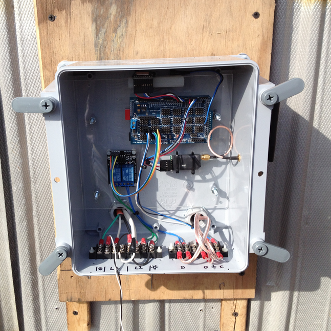

# GaryCooper
An [Arduino](https://en.wikipedia.org/wiki/Arduino)
project to automatically open and close a chicken coop door based on
sunrise and sunset times.

Basic hardware requirements:

* Arduino (I used a [Mega 2560](http://www.microcenter.com/product/431995/Arduino_Mega_2560))
* GPS receiver.
* Relay to control the coop door opener.

Advanced hardware requirements:

* Beeper for notification.
* Radio telemetry link (originally for drones) to send status info back to the
  house.
* Additional relay to control the coop light.

My wife and I got tired of getting up early to let the chickens out. Like any
good geek, I said I could solve that problem with a computer and some
additional hardware. I called the project Gary Cooper; Gary for short. I wanted
a solution that was simple to operate:

1. Turn it on.
2. Forget it.

The biggest part of the "additional hardware" is the stuff to physically open
and close the coop door. I am using an old garage door opener. Once that was
installed, software development commenced. The problem is more difficult than
it first appears.

As it turns out, chickens don't have watches and they don't observe the USA's
stupid daylight saving time convention. See, they're not as dumb as you might
think. Their wake/sleep cycle depends on the length of the days, and their
circadian rhythms as influenced by each day's sunrise and sunset times. They
wake up each morning, even if it is very overcast and the light level is quite
low. This means that a simple light level sensor will have problems getting in
sync with the birds. On overcast days opening and closing the door based on a
simple light level sensor risks letting the birds out late and, even worse,
locking some birds out of the coop by shutting the door too early in the
evening. Chickens left outside over night become racoon and weasel food, which
seriously impacts their ability to produce eggs. So, controlling the door based
on sunrise and sunset times is a better choice.

To make things more complicated, sunrise and sunset times depend on the date
and the coop's location on Earth. Days are longer during the summer months and
shorter in the winter. Spring and fall fall somewhere in between. To solve this
problem, this project uses a GPS receiver to determine both date and location.
From there, the sunrise and sunset times are calculated and the door is opened
and closed based on these times. (It is actually a little more complicated than
that, but those complications are handled in the code.) All times are handled
in [UTC](https://en.wikipedia.org/wiki/UTC), so daylight saving time does not
complicate the problem.

Did you know that chickens adjust their egg output based on day length? Longer
days yield more eggs per week. Shorter days -  fewer eggs. However, by adding
additional light in their coop in the morning and evening we can fool their
bodies into thinking the day is longer. Gary handles that as well.

Basic Operation:
The Arduino reads the data from the GPS receiver and passes it to the GPS
parser. If there is valid data, the data is passed to a sunrise/sunset
calculator object which figures the times based on date and location.

A door controller object monitors the current time relative to the sunrise and
sunset times and decides when to open and close the door. I call the amount of
time the door is open the chicken's "day length."

There is another object that controls the coop light. It monitors the chicken's
day length and decides if the light should be turned on early and left on late.
This object also provides additional light after the door is opened in the
morning to help the chickens get their day started, and turns it on before the
door closes in the evening to draw them back into the coop. The light is off
most of the day.

Status and error information is transmitted back to the house. The status info
lets us know when the door opens and closes, and when the light is on. The
error information is to alert us to GPS lock problems, the door being stuck,
and such things. I have another repository here - its name is wxVeronica.
[wxVeronica](https://github.com/jondbennett/wxVeronica) is a wxWidgets application
that runs in the house. It provides voice notification of various coop events
and error/warning notifications. It can also send configuration changes back to
Gary to alter the door and light schedule, or to remotely open/close the door
or turn the light on and off.

This project depends on my
[GPSParser](https://github.com/jondbennett/GPSParser),
[PMS](https://github.com/jondbennett/PMS), and
[SaveController](https://github.com/jondbennett/SaveController) libraries,
so you'll need to download them as well.

The files "sunriset.h" and "sunriset.cpp" were downloaded as-is from:
http://www.stjarnhimlen.se/

  

More [implementation photos.](http://jondbennett.com/photo-galleries/52-garycooper-chicken-coop-door-controller)

